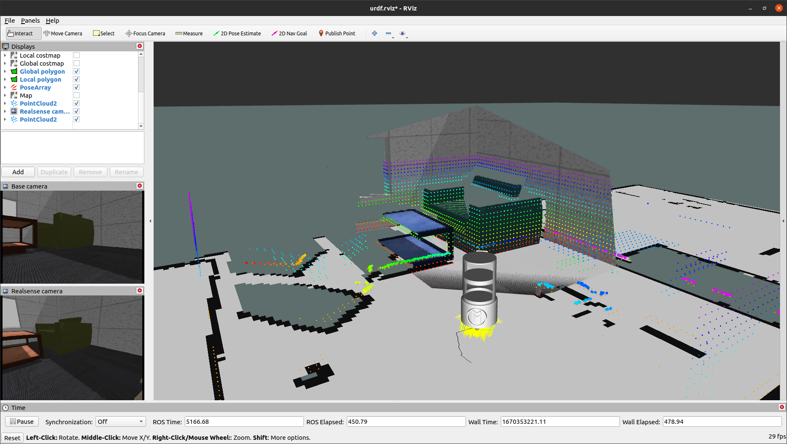

# An autonomous waiter robot

### Overview
This is a personal project to create a waiter robot that can autonomously navigate a restaurant and serve customers. 

I am doing this project to practice my skills in ROS, Gazebo, and robot description (using Fusion 360). I am also doing this project to learn more about the ROS navigation stack, Gmapping, and how to use them to create a robot that can navigate autonomously.

The robot is equipped with a 2D LiDAR, an Intel RealSense D435 camera, and a regular RGB camera. The 2D LiDAR is used to create a 2D map of the environment with the aid of Gmapping, whereas the RGB-D camera is mainly used to avoid obstacles when navigating. Both cameras will be later used to detect customers and serve them. Besides, its motion model is a differential drive. 

The images below illustrate the robot navigating through the environment while it builds a partial 3D map of the environment. Such a partial 3D map perfectly matches with the 3D point cloud from the RealSense camera.




### How to run

So far, there are two launch files that can be used to run the robot:
 - <strong>Autonomous navigation</strong>: This launch file will launch the robot in Gazebo and RViz. The robot will navigate autonomously through the environment while avoiding obstacles.
```bash
roslaunch circular_waiter_robot_description autonomous_navigation.launch
```
 - <strong>Autonomous mapping</strong>: This launch file will launch the robot in Gazebo and RViz. The robot will navigate autonomously through the environment while building a 2D map of the environment.
```bash
roslaunch circular_waiter_robot_description autonomous_mapping.launch
```

### TO DO list:
 - [ ] Python scripts to make the robot navigate autonomously
 - [ ] Include more info to this README file
 - [ ] Develop Gazebo scripts to make the robot interact with the environment (get and delivery plates, etc.)
 - [ ] Include the dependencies to the README file
 - [ ] Include object detection package to the project